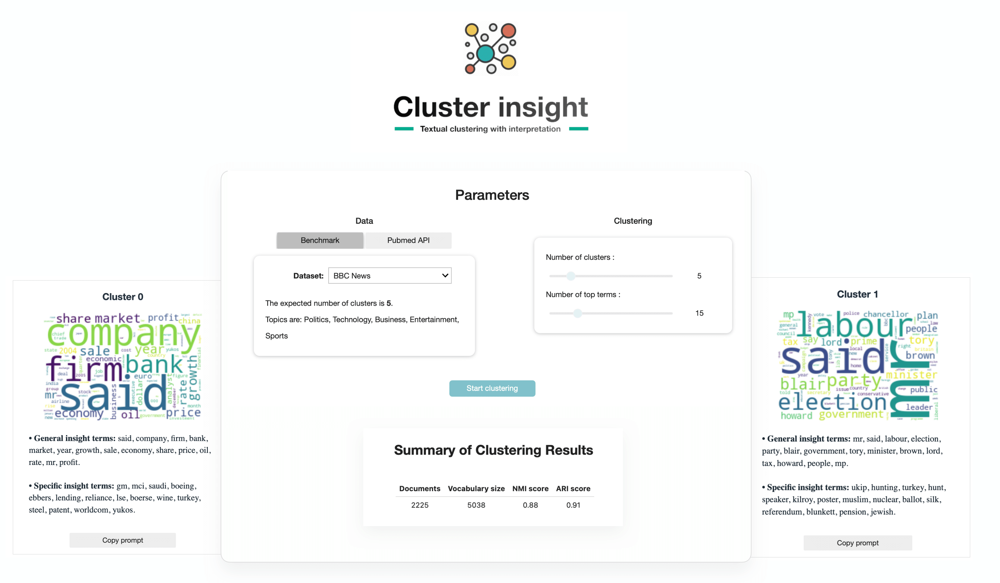

  <h1>Cluster Insight: A Weighted Clustering Tool for Large Textual Data Exploration</h1>

  

**Cluster Insight** is a Python package and web application designed for the analysis and exploration of large textual datasets using weighted clustering techniques.

## Regularized Lasso-Weighted K-means

The web application is powered by a Regularized version of the Lasso-Weighted K-means algorithm (R-Lwk), specifically adapted for textual data analysis.

The table below shows the clustering performance of the R-Lwk algorithm on various textual datasets:

| Method   | Sports   | TR45     | Classic4 | CSTR     | OHSCALE  | NG20     | BBC      |
| -------- | -------- | -------- | -------- | -------- | -------- | -------- | -------- |
| R-Lwk    | **0.65** | **0.70** | **0.79** | **0.76** | **0.45** | **0.59** | **0.90** |
| Lwk      | 0.47     | 0.66     | 0.69     | 0.66     | 0.42     | 0.47     | 0.78     |
| S-Kmeans | 0.64     | 0.66     | 0.68     | 0.69     | 0.43     | 0.55     | 0.87     |
| K-means  | 0.45     | 0.63     | 0.55     | 0.60     | 0.37     | 0.39     | 0.71     |

## Cluster Insight Web Application

The **Cluster Insight** web application, built on top of the R-Lwk package (the full source code will be soon available), allows for the analysis and exploration of textual data. The app can be used either locally with your own data or through a web interface, which comes preloaded with 5 benchmark datasets. You can also fetch documents directly from the [PubMed API](https://www.ncbi.nlm.nih.gov/home/develop/api/) by entering a search query.

## R-Lwk Package Architecture

- **io:**
  - `load_benchmark`: Load benchmark datasets.
  - `parse_pubmed_api`: Fetch data from PubMed API.
- **utils:**
  - `pre-processing`: Text pre-processing steps.
  - `get_top_features`: Extract top terms based on feature weights.
  - `get_top_terms_count`: Get top terms for each cluster based on term frequencies.
  - `get_top_terms_weight`: Extract top terms for each cluster based on feature weights.
- **RLWK:**
  - `Rlwk`: Class containing the R-Lwk algorithm.
    - `__init__`: Initialize the model.
    - `fit`: Fit the model to data.
    - `errors_calculate`: Calculate errors in clustering.
- **visualization:**
  - `create_cluster_distribution_plot`: Visualize cluster distribution.
  - `create_top_terms_plot`: Plot top terms.
  - `create_wordcloud_plot`: Generate word clouds for clusters.
  - `plot_cluster_summaries`: Summarize clustering results.
  - `plot_summary`: Provide an overall summary.
  - `copy_to_clipboard`: Copy summary to clipboard.

## Core Modules

- [Coclust](https://coclust.readthedocs.io/en/v0.2.1/)
- [scikit-learn](https://scikit-learn.org/stable/install.html)
- [Jupyter Widgets](https://ipywidgets.readthedocs.io/en/stable/)
- [Voilà](https://voila.readthedocs.io/en/stable/)
- [Bootstrap](https://getbootstrap.com/)
